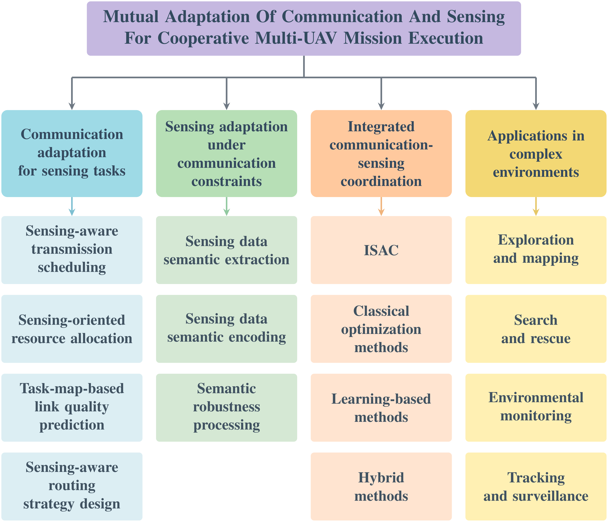
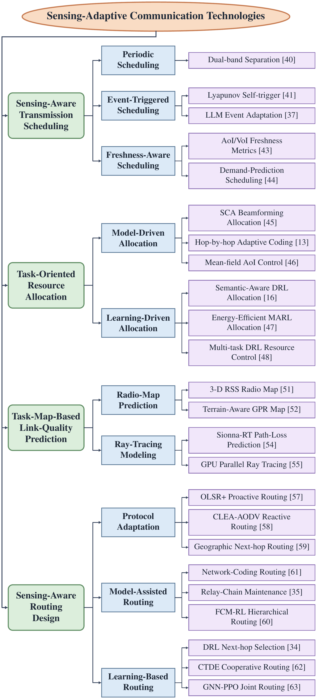

# Mutual Adaptation of Communication and Sensing for Cooperative Multi-UAV in Complex Environments

[](https://github.com/sindresorhus/awesome)  

## 📢 Foreword

This repository accompanies our survey **"Mutual Adaptation of Communication and Sensing for Cooperative Multi-UAV in Complex Environments: A Survey"** and continuously tracks the development of this field. It provides a curated collection of papers on the mutual adaptation of communication and sensing for cooperative multi-UAV systems operating in complex environments (e.g., underground spaces, post-disaster ruins, mountainous forests, and offshore areas) that lack stable satellite positioning, prior maps, and ground-based communication infrastructure.

Following the taxonomy of the survey, the collected works are organized into three mutually adaptive aspects: **communication technologies adapting to sensing tasks**, **sensing technologies adapting to communication conditions**, and **integrated coordination methods of communication and sensing**, followed by **typical applications in complex environments**.

## 📰 News

- **[2026.06]** Repository released. Paper lists will be continuously updated.

## 📜 Table of Contents

- [📢 Foreword](#-foreword)
- [📰 News](#-news)
- [🗺️ Taxonomy](#%EF%B8%8F-taxonomy)
- [⏳ Related Surveys](#-related-surveys)
- [📡 Communication Technologies Adapting to Sensing Tasks](#-communication-technologies-adapting-to-sensing-tasks)
  - [Network Foundations and Communication Requirements](#network-foundations-and-communication-requirements)
  - [Transmission Scheduling Adapting to Sensing](#transmission-scheduling-adapting-to-sensing)
  - [Resource Allocation for Sensing Tasks](#resource-allocation-for-sensing-tasks)
  - [Link Quality Prediction Based on the Mission Map](#link-quality-prediction-based-on-the-mission-map)
  - [Routing Strategy Design for Sensing-Adaptive Networks](#routing-strategy-design-for-sensing-adaptive-networks)
- [👁️ Sensing Technologies Adapting to Communication Conditions](#%EF%B8%8F-sensing-technologies-adapting-to-communication-conditions)
  - [Semantic Extraction of Sensing Data](#semantic-extraction-of-sensing-data)
  - [Semantic Encoding of Sensing Data](#semantic-encoding-of-sensing-data)
  - [Semantic Robustness Processing](#semantic-robustness-processing)
- [🤝 Integrated Coordination of Communication and Sensing](#-integrated-coordination-of-communication-and-sensing)
  - [Integrated Sensing and Communication (ISAC)](#integrated-sensing-and-communication-isac)
  - [Classical Optimization Methods](#classical-optimization-methods)
  - [Learning-Based Methods](#learning-based-methods)
  - [Hybrid Methods](#hybrid-methods)
- [🚁 Applications in Complex Environments](#-applications-in-complex-environments)
- [🔭 Future Directions](#-future-directions)
- [✍️ Citation](#%EF%B8%8F-citation)
- [🙏 Acknowledgement](#-acknowledgement)

## 🗺️ Taxonomy

The hierarchical taxonomy of communication-sensing mutual adaptation methods covered by this survey:

<p align="center"></p>

## ⏳ Related Surveys

Recent surveys related to multi-UAV communication and sensing. **Category A**: communication optimization of multi-UAV systems; **Category B**: sensing capability of multi-UAV systems; **Category C**: specific scenarios or multi-technology coordination.

| Year | Publication | Title | Category | Link |
|:---:|:---:|---|:---:|:---:|
|2023|IEEE COMST|Toward Autonomous Multi-UAV Wireless Network: A Survey of Reinforcement Learning-Based Approaches|A|[Paper](https://doi.org/10.1109/COMST.2023.3323344)|
|2024|IEEE COMST|Machine Learning-Aided Operations and Communications of Unmanned Aerial Vehicles: A Contemporary Survey|A|[Paper](https://doi.org/10.1109/COMST.2023.3312221)|
|2024|IEEE COMST|Computational Intelligence Algorithms for UAV Swarm Networking and Collaboration: A Comprehensive Survey and Future Directions|C|[Paper](https://doi.org/10.1109/COMST.2024.3395358)|
|2024|IEEE TCCN|Key Technologies and Applications of UAVs in Underground Space: A Review|C|[Paper](https://doi.org/10.1109/TCCN.2024.3358545)|
|2025|IEEE Access|A Comprehensive Review on Sensor Fusion Techniques for Localization of a Dynamic Target in GPS-Denied Environments|B|[Paper](https://doi.org/10.1109/ACCESS.2024.3519874)|
|2025|IEEE Access|The Rise of UAV-Based Smart Surveillance: A Systematic Review of Trends and Technologies|B|[Paper](https://doi.org/10.1109/ACCESS.2025.3621736)|
|2025|IEEE T-ITS|A Survey on Autonomous and Intelligent Swarms of Uncrewed Aerial Vehicles (UAVs)|C|[Paper](https://doi.org/10.1109/TITS.2025.3569500)|
|2026|Engineering Information Technology & Electronic Engineering|Low-Altitude UAV Swarm ISAC: New Opportunities and Challenges|C|[Paper](https://doi.org/10.1631/ENG.ITEE.2026.0030)|
|2026|IEEE Access|Safe Search and Rescue Operations Based on Autonomous Robots: A Systematic Review of the General System Architecture|C|[Paper](https://doi.org/10.1109/ACCESS.2026.3660002)|
|2026|IEEE COMST|A Survey on DRL-Based UAV Communications and Networking: DRL Fundamentals, Applications and Implementations|A|[Paper](https://doi.org/10.1109/COMST.2025.3581912)|
|2026|IEEE COMST|A Survey on Detection, Classification, and Tracking of AAVs Using Radar and Communications Systems|B|[Paper](https://doi.org/10.1109/COMST.2025.3554613)|
|2026|IEEE COMST|Multi-Modal Intelligent Channel Modeling: A New Modeling Paradigm via Synesthesia of Machines|B|[Paper](https://doi.org/10.1109/COMST.2025.3558046)|
|2026|IEEE OJ-COMS|A Survey on Unmanned Aerial Vehicles (UAVs) Communications: State-of-the-Art, Existing Standards, and Future Directions|A|[Paper](https://doi.org/10.1109/OJCOMS.2026.3675046)|
|2026|IEEE Sensors Journal|Multi-UAV Cooperative Navigation Based on Multisource Information Fusion: A Review|B|[Paper](https://doi.org/10.1109/JSEN.2025.3646302)|


## 📡 Communication Technologies Adapting to Sensing Tasks

Communication design that takes the sensing demand as the starting point of its scheduling logic, instead of optimizing link quality in isolation.

<p align="center"></p>

### Network Foundations and Communication Requirements

Flying ad hoc network (FANET) topology organization and the differentiated communication requirements of cooperative sensing information flows (control states, mission events, semantic features, and dense observations).

| Year | Publication | Title | Category | Link |
|:---:|:---:|---|:---:|:---:|
|2024|ICRA|Opportunistic Communication in Robot Teams|Opportunistic communication|[Paper](https://doi.org/10.1109/ICRA57147.2024.10610971)|
|2024|IEEE Network|Task-Oriented Wireless Communications for Collaborative Perception in Intelligent Unmanned Systems|Task-oriented communication|[Paper](https://doi.org/10.1109/MNET.2024.3414144)|
|2024|IEEE TMC|Dynamic Topology Organization and Maintenance Algorithms for Autonomous UAV Swarms|Topology organization|[Paper](https://doi.org/10.1109/TMC.2023.3293034)|
|2024|IEEE TNSE|Frisbee: An Efficient Data Sharing Framework for UAV Swarms|Data sharing framework|[Paper](https://doi.org/10.1109/TNSE.2024.3479695)|
|2024|IEEE TVT|Formation Control Algorithms for Multi-UAV Systems With Unstable Topologies and Hybrid Delays|Formation control state|[Paper](https://doi.org/10.1109/TVT.2024.3383352)|
|2026|IEEE TNSE|IACTS: An Intelligent Adaptive Communication Topological Scheme for Subterranean UAV Network|Hierarchical topology|[Paper](https://doi.org/10.1109/TNSE.2025.3591118)|

### Transmission Scheduling Adapting to Sensing

Determining the transmission timing and data priority of each node: periodic scheduling, event-triggered scheduling, and information-freshness-driven scheduling.

| Year | Publication | Title | Category | Link |
|:---:|:---:|---|:---:|:---:|
|2023|IEEE TCOM|Cooperative Data Collection With Multiple UAVs for Information Freshness in the Internet of Things|Freshness-driven (AoI)|[Paper](https://doi.org/10.1109/TCOMM.2023.3255240)|
|2023|IROS|A Distributed Scheduling Method for Networked UAV Swarm based on Computing for Communication|Freshness-driven (demand prediction)|[Paper](https://doi.org/10.1109/IROS55552.2023.10342228)|
|2024|IEEE TVT|Dual-Frequency Cooperation MAC for UAV Networks: Protocol Design and Performance Analysis|Periodic (dual-band TDMA)|[Paper](https://doi.org/10.1109/tvt.2024.3374516)|
|2025|IEEE TASE|Synergistic Constrained Control of 6-DOF Fixed-Wing Multi-UAVs With Dynamic Self-Triggered Communication|Event-triggered (Lyapunov)|[Paper](https://doi.org/10.1109/TASE.2025.3545933)|
|2025|IEEE TNSE|3D Self-Triggered-Organized Communication Topology Based UAV Swarm Consensus System With Distributed Extended State Observer|Event-triggered (3D topology)|[Paper](https://doi.org/10.1109/TNSE.2025.3567462)|
|2026|IEEE TCCN|LLM-Based Dynamic Event-Triggered Communication for Multi-UAV Formation Control in Urban Environments|Event-triggered (LLM)|[Paper](https://doi.org/10.1109/TCCN.2025.3644040)|

### Resource Allocation for Sensing Tasks

Differentiated allocation of limited spectrum and power according to mission priority and freshness requirements of sensing data.

| Year | Publication | Title | Category | Link |
|:---:|:---:|---|:---:|:---:|
|2023|IEEE TWC|Multi-UAV Collaborative Sensing and Communication: Joint Task Allocation and Power Optimization|Model-driven (SCA)|[Paper](https://doi.org/10.1109/TWC.2022.3224143)|
|2024|IEEE TVT|Age of Information Minimization Using Multi-Agent UAVs Based on AI-Enhanced Mean Field Resource Allocation|Model-driven (mean-field game)|[Paper](https://doi.org/10.1109/tvt.2024.3394235)|
|2025|IEEE TCOM|Hop-by-Hop Redundancy-Guaranteed Adaptive Coding for Enhancing Transmission Reliability of UAV Networks|Model-driven (adaptive coding)|[Paper](https://doi.org/10.1109/TCOMM.2025.3534556)|
|2025|IEEE TCOM|Resource Allocation for Multi-Modal Semantic Communication in UAV Collaborative Networks|Learning-based (DRL, semantic-aware)|[Paper](https://doi.org/10.1109/TCOMM.2025.3552303)|
|2025|IEEE TGCN|Resource Allocation for UAV Swarm-Assisted Green ISAC Networks via Multi-Agent RL|Learning-based (MARL)|[Paper](https://doi.org/10.1109/TGCN.2024.3487995)|
|2026|IEEE IoT-J|Wireless Resource Optimization for UAV Swarm Cooperative Sensing via Multiagent Multitask Deep Reinforcement Learning|Learning-based (multi-task DRL)|[Paper](https://doi.org/10.1109/JIOT.2026.3657123)|

### Link Quality Prediction Based on the Mission Map

Converting the environment model produced by cooperative sensing into link-quality predictions via radio maps and ray tracing.

| Year | Publication | Title | Category | Link |
|:---:|:---:|---|:---:|:---:|
|2023|GLOBECOM|Sionna RT: Differentiable Ray Tracing for Radio Propagation Modeling|Ray tracing (differentiable)|[Paper](https://doi.org/10.1109/GCWkshps58843.2023.10465179)|
|2023|IEEE TWC|UAV-Aided Radio Map Construction Exploiting Environment Semantics|Radio map (environment semantics)|[Paper](https://doi.org/10.1109/twc.2023.3241845)|
|2024|IEEE IoT-J|Compressed Tensor Completion: Approach for UAV-Aided 3-D Radio Map Construction|Radio map (3D construction)|[Paper](https://doi.org/10.1109/jiot.2024.3451713)|
|2024|IEEE OJ-COMS|Machine Learning for Radio Propagation Modeling: A Comprehensive Survey|Radio map (ML survey)|[Paper](https://doi.org/10.1109/OJCOMS.2024.3446457)|
|2024|IEEE TAP|Path Loss Prediction in Urban Environments With Sionna-RT Based on Accurate Propagation Scene Models at 2.8 GHz|Ray tracing (urban validation)|[Paper](https://doi.org/10.1109/tap.2024.3451214)|
|2025|IEEE AWPL|A High-Performance GPU-Accelerated Ray-Tracing Method for Real-Time V2V Channel Modeling|Ray tracing (GPU real-time)|[Paper](https://doi.org/10.1109/lawp.2025.3567499)|
|2025|IEEE IoT-J|GPRT: A Gaussian Process Regression-Based Radio Map Construction Method for Rugged Terrain|Radio map (GPR, terrain-aware)|[Paper](https://doi.org/10.1109/jiot.2025.3554507)|

### Routing Strategy Design for Sensing-Adaptive Networks

Hop-by-hop forwarding under rapidly time-varying FANET topologies: model-based and learning-based adaptive routing.

| Year | Publication | Title | Category | Link |
|:---:|:---:|---|:---:|:---:|
|2020|IEEE COMST|Routing in Flying Ad Hoc Networks: A Comprehensive Survey|FANET routing survey|[Paper](https://doi.org/10.1109/COMST.2020.2982452)|
|2022|Sustainability|Cross-Layer and Energy-Aware AODV Routing Protocol for Flying Ad-Hoc Networks|Reactive (AODV)|[Paper](https://doi.org/10.3390/su14158980)|
|2022|Vehicular Communications|OLSR+: A New Routing Method Based on Fuzzy Logic in Flying Ad-Hoc Networks (FANETs)|Proactive (OLSR+)|[Paper](https://doi.org/10.1016/j.vehcom.2022.100489)|
|2023|IEEE TVT|A Position-Based Modified OLSR Routing Protocol for Flying Ad Hoc Networks|Proactive (position-based OLSR)|[Paper](https://doi.org/10.1109/tvt.2023.3265704)|
|2023|IEEE TVT|Learning to Routing in UAV Swarm Network: A Multi-Agent Reinforcement Learning Approach|Learning-based (CTDE MARL)|[Paper](https://doi.org/10.1109/tvt.2022.3232815)|
|2024|ICCWAMTIP|A Novel Chain Multi-UAV Communication Relay Maintenance Control|Model-based (chain relay)|[Paper](https://doi.org/10.1109/iccwamtip64812.2024.10873711)|
|2024|IEEE TCOM|Reinforcement Learning Based Energy-Efficient Fast Routing for FANETs|Learning-based (DRL)|[Paper](https://doi.org/10.1109/tcomm.2024.3409561)|
|2025|IEEE LNET|GNNPPOR: A Proximal Policy Optimization Multi-Factor Joint Routing Approach Based on Graph Neural Networks in FANETs|Learning-based (GNN+PPO)|[Paper](https://doi.org/10.1109/lnet.2025.3542762)|
|2025|IEEE Sensors Journal|RSTrS: A Reliable and Stable Data Transmission Scheme via OLSR and Network Coding in FANET|Model-based (network coding)|[Paper](https://doi.org/10.1109/jsen.2024.3511934)|
|2026|IEEE TCCN|Communication-Aware Hierarchical Routing for FANET: A Reinforcement Learning Approach|Model-based (hierarchical, FCM-RL)|[Paper](https://doi.org/10.1109/tccn.2025.3620368)|


## 👁️ Sensing Technologies Adapting to Communication Conditions

The sensing side actively adjusts its processing strategy according to the communication state, transforming raw observations into semantic representations adapted to low bandwidth and unstable links.

### Semantic Extraction of Sensing Data

Selecting key information units from high-dimensional observations: feature-level selective sharing, semantic extraction of map data, and task-driven extraction.

| Year | Publication | Title | Category | Link |
|:---:|:---:|---|:---:|:---:|
|2024|ICARA|Collaborative SLAM with Convolutional Neural Network-based Descriptor for Inter-Map Loop Closure Detection|Map-level (CNN loop-closure descriptor)|[Paper](https://doi.org/10.1109/icara60736.2024.10553178)|
|2024|IEEE IV|Graph Attention Based Feature Fusion For Collaborative Perception|Feature-level (graph attention)|[Paper](https://doi.org/10.1109/iv55156.2024.10588712)|
|2024|IEEE IoT-J|Multimodal Virtual Semantic Communication for Tiny-Machine-Learning-Based UAV Task Execution|Task-driven (cross-modal alignment)|[Paper](https://doi.org/10.1109/jiot.2024.3416253)|
|2024|IEEE RA-L|LECES: A Low-Bandwidth and Efficient Collaborative Exploration System With Distributed Multi-UAV|Map-level (occupancy grid)|[Paper](https://doi.org/10.1109/LRA.2024.3433200)|
|2025|CVPR|CoSDH: Communication-Efficient Collaborative Perception via Supply-Demand Awareness and Intermediate-Late Hybridization|Feature-level (supply-demand)|[Paper](https://doi.org/10.1109/cvpr52734.2025.00641)|
|2025|IEEE IoT-J|Distributed Robust Communication-Efficient Multirobot SLAM Combining Real-Time Intersection and Historical Loop Constraints|Map-level (constraint scheduling)|[Paper](https://doi.org/10.1109/jiot.2025.3556850)|
|2025|IEEE RA-L|PC-Explorer: Decentralized Multi-UAV Exploration in Bandwidth-Limited Environments|Map-level (keypoints + frontier sync)|[Paper](https://doi.org/10.1109/LRA.2025.3592139)|
|2025|IEEE RA-L|Communication-Aware Hierarchical Map Compression of Time-Varying Environments for Mobile Robots|Map-level (hierarchical compression)|[Paper](https://doi.org/10.1109/LRA.2025.3622863)|
|2025|IEEE TCOM|Task-Oriented Semantic Communication for Stereo-Vision 3D Object Detection|Task-driven (stereo 3D detection)|[Paper](https://doi.org/10.1109/tcomm.2025.3545687)|
|2025|IEEE TCOM|UAV Cognitive Semantic Communications Enabled by Knowledge Graph for Robust Object Detection|Task-driven (knowledge graph)|[Paper](https://doi.org/10.1109/tcomm.2025.3538850)|
|2025|IEEE TMC|Streamlining Data Transfer in Collaborative SLAM Through Bandwidth-Aware Map Distillation|Map-level (map distillation)|[Paper](https://doi.org/10.1109/TMC.2025.3549367)|
|2025|IEEE TMC|Towards Communication-Efficient Cooperative Perception via Planning-Oriented Feature Sharing|Task-driven (planning utility)|[Paper](https://doi.org/10.1109/tmc.2024.3496856)|
|2025|IEEE TWC|Task-Oriented Low-Label Semantic Communication With Self-Supervised Learning|Map-level (self-supervised descriptor)|[Paper](https://doi.org/10.1109/twc.2025.3574468)|
|2026|IEEE TVT|Decentralized Semantic Communication and Cooperative Tracking Control for a UAV Swarm Over Wireless MIMO Fading Channels|Task-driven (cooperative tracking)|[Paper](https://doi.org/10.1109/TVT.2025.3601731)|

### Semantic Encoding of Sensing Data

Transforming the extracted content into channel-adaptive transmission representations.

| Year | Publication | Title | Category | Link |
|:---:|:---:|---|:---:|:---:|
|2023|ICASSP|WITT: A Wireless Image Transmission Transformer for Semantic Communications|DeepJSCC (Swin Transformer)|[Paper](https://doi.org/10.1109/ICASSP49357.2023.10094735)|
|2023|IEEE JSAC|Generative Joint Source-Channel Coding for Semantic Image Transmission|Generative (deep generative prior)|[Paper](https://doi.org/10.1109/JSAC.2023.3288243)|
|2023|IEEE TWC|Robust Semantic Communications With Masked VQ-VAE Enabled Codebook|Masked generative (masked VQ-VAE)|[Paper](https://doi.org/10.1109/TWC.2023.3265201)|
|2023|VTC-Fall|Semantic Communication for Efficient Image Transmission Tasks Based on Masked Autoencoders|Masked generative (MAE)|[Paper](https://doi.org/10.1109/VTC2023-Fall60731.2023.10333576)|
|2024|GLOBECOM|Semantic Communication for Efficient Point Cloud Transmission|DeepJSCC (point cloud)|[Paper](https://doi.org/10.1109/globecom52923.2024.10901573)|
|2024|RICAI|Efficient Collaborative Perception with Adaptive Communication in Bandwidth-Constrained Scenarios|Progressive (adaptive compression ratio)|[Paper](https://doi.org/10.1109/ricai64321.2024.10910966)|
|2025|China Communications|Deep learning based progressive joint source-channel coding for wireless image transmission|Progressive variable-rate|[Paper](https://doi.org/10.23919/jcc.fa.2023-0778.202505)|
|2025|ICASSP|Deep Joint Source-Channel Coding for Wireless Point Cloud Transmission|DeepJSCC (point cloud)|[Paper](https://doi.org/10.1109/ICASSP49660.2025.10889738)|
|2025|ICRA|Bandwidth-Adaptive Spatiotemporal Correspondence Identification for Collaborative Perception|Progressive (bandwidth-adaptive)|[Paper](https://doi.org/10.1109/ICRA55743.2025.11127581)|
|2025|IEEE Access|Rateless Deep Joint Source Channel Coding for 3D Point Cloud|Progressive (rateless point cloud)|[Paper](https://doi.org/10.1109/access.2025.3546514)|
|2025|IEEE IoT-J|Vision Transformer-Based Semantic Communications With Importance-Aware Quantization|DeepJSCC (importance-aware ViT)|[Paper](https://doi.org/10.1109/jiot.2025.3580597)|
|2025|IEEE JSAC|D²-JSCC: Digital Deep Joint Source-Channel Coding for Semantic Communications|Codebook-indexed (D²-JSCC)|[Paper](https://doi.org/10.1109/JSAC.2025.3531546)|
|2025|IEEE TCCN|Joint Source-Channel Coding for Channel-Adaptive Digital Semantic Communications|Codebook-indexed (channel-adaptive)|[Paper](https://doi.org/10.1109/TCCN.2024.3422496)|
|2025|IEEE TWC|Diffusion-Driven Semantic Communication for Generative Models With Bandwidth Constraints|Generative (diffusion)|[Paper](https://doi.org/10.1109/twc.2025.3553851)|
|2025|IEEE WCL|Channel-Aware Deep Joint Source-Channel Coding for Multi-Task Oriented Semantic Communication|DeepJSCC (channel-aware)|[Paper](https://doi.org/10.1109/lwc.2025.3548084)|
|2025|Proc. IEEE|Joint Source-Channel Coding: Fundamentals and Recent Progress in Practical Designs|DeepJSCC (fundamentals)|[Paper](https://doi.org/10.1109/jproc.2024.3477331)|
|2026|IEEE OJ-COMS|Generative AI-Enhanced Robust Semantic Communication Architecture for AAV Image Transmission|Generative (diffusion, AAV link)|[Paper](https://doi.org/10.1109/OJCOMS.2026.3660029)|

### Semantic Robustness Processing

Compensating semantic degradation from channel noise, distribution shift, and cross-node model drift.

| Year | Publication | Title | Category | Link |
|:---:|:---:|---|:---:|:---:|
|2024|IEEE WCM|Federated Learning Powered Semantic Communication for UAV Swarm Cooperation|Federated codec consistency|[Paper](https://doi.org/10.1109/mwc.005.2300147)|
|2025|IEEE JSAC|Tackling Distribution Shifts in Task-Oriented Communication With Information Bottleneck|Distribution-shift robustness (IRM)|[Paper](https://doi.org/10.1109/jsac.2025.3559116)|
|2025|IEEE TCOM|UAV Cognitive Semantic Communications Enabled by Knowledge Graph for Robust Object Detection|Knowledge-graph correction|[Paper](https://doi.org/10.1109/tcomm.2025.3538850)|
|2026|IEEE TCCN|Semantic Communication for Cooperative Perception Using HARQ|Semantic HARQ|[Paper](https://doi.org/10.1109/tccn.2025.3579540)|


## 🤝 Integrated Coordination of Communication and Sensing

### Integrated Sensing and Communication (ISAC)

Sharing the RF front end and spectrum so that the same waveform carries both data transmission and sensing functions.

| Year | Publication | Title | Category | Link |
|:---:|:---:|---|:---:|:---:|
|2022|IEEE/ACM ToN|Ultra-Wideband Swarm Ranging Protocol for Dynamic and Dense Networks|UWB swarm ranging|[Paper](https://doi.org/10.1109/tnet.2022.3186071)|
|2022|WCNC|A Multiple Access Method For Integrated Sensing and Communication Enabled UAV Ad Hoc Network|Multi-beam ISAC framework|[Paper](https://doi.org/10.1109/WCNC51071.2022.9771628)|
|2024|IEEE COMML|Multi-Target Tracking With Dual-Functional Radar-Communication UAV Swarm|DFRC multi-target tracking|[Paper](https://doi.org/10.1109/LCOMM.2024.3434446)|
|2025|CROS|Simultaneous Localization and Communication Based on UWB for UAV Applications|UWB localization + communication|[Paper](https://doi.org/10.1109/cros66186.2025.11066140)|
|2025|IEEE COMMAG|Integrated Communication, Positioning, and Sensing for UAV Swarms in Unknown Complex Environments|Comm-positioning-sensing architecture|[Paper](https://doi.org/10.1109/MCOM.001.2500169)|
|2025|IEEE TIM|Distributed Cooperative Localization for Unmanned Systems Using UWB/INS Integration in GNSS-Denied Environments|UWB/INS cooperative localization|[Paper](https://doi.org/10.1109/tim.2025.3559161)|
|2025|IEEE TVT|DPCS-SDMA: An ISAC-Aided MAC Protocol for Flying Ad Hoc Networks|ISAC-aided MAC protocol|[Paper](https://doi.org/10.1109/TVT.2025.3555102)|
|2026|IEEE IoT Mag.|Integrated Sensing, Communication and Control Enabled Agile UAV Swarm|Integrated sensing-comm-control|[Paper](https://doi.org/10.1109/MIOT.2025.3647932)|
|2026|IEEE Sensors Journal|Knowledge-Guided Reinforcement Learning for Beamforming and Trajectory Design in Multi-UAV Aerial ISAC System|ISAC beamforming (aerial network)|[Paper](https://doi.org/10.1109/JSEN.2026.3683952)|
|2026|IEEE TGCN|Transmit-Receive Beamforming for ISAC-Enabled Multi-UAVs System|ISAC transmit-receive beamforming|[Paper](https://doi.org/10.1109/TGCN.2025.3594962)|

### Classical Optimization Methods

Heuristic search and strategy-design-based methods for cooperative multi-UAV communication and sensing planning.

| Year | Publication | Title | Category | Link |
|:---:|:---:|---|:---:|:---:|
|2024|IEEE IoT-J|Fair Integrated Sensing and Communication for Multi-UAV-Enabled Internet of Things: Joint 3-D Trajectory and Resource Optimization|Strategy design (AO, trajectory+resource)|[Paper](https://doi.org/10.1109/JIOT.2023.3327445)|
|2024|IEEE IoT-J|A Joint UAV Trajectory, User Association, and Beamforming Design Strategy for Multi-UAV-Assisted ISAC Systems|Strategy design (matching + FP)|[Paper](https://doi.org/10.1109/JIOT.2024.3430390)|
|2024|IEEE OJ-COMS|Optimizing Multi-UAV Multi-User System Through Integrated Sensing and Communication for Age of Information (AoI) Analysis|Heuristic (PSO, AoI-aware ISAC)|[Paper](https://doi.org/10.1109/ojcoms.2024.3489873)|
|2024|IEEE Sensors Journal|Communication-Constrained UAVs' Coverage Search Method in Uncertain Scenarios|Heuristic (coverage search)|[Paper](https://doi.org/10.1109/jsen.2024.3384261)|
|2024|IEEE TNSM|ESCM: An Efficient and Secure Communication Mechanism for UAV Networks|Heuristic (artificial bee colony)|[Paper](https://doi.org/10.1109/TNSM.2024.3357824)|
|2024|IEEE TVT|AoI-Aware Sensing Scheduling and Trajectory Optimization for Multi-UAV-Assisted Wireless Backscatter Networks|Strategy design (Lyapunov, AoI)|[Paper](https://doi.org/10.1109/TVT.2024.3402740)|
|2024|IEEE TWC|Joint Optimization of UAV Deployment and Directional Antenna Orientation for Multi-UAV Cooperative Sensing System|Strategy design (AO, deployment+antenna)|[Paper](https://doi.org/10.1109/twc.2024.3407837)|
|2025|IEEE IoT-J|Game-Theoretic Optimization for Multi-UAV Integrated Sensing and Communication Networks|Strategy design (game theory)|[Paper](https://doi.org/10.1109/jiot.2025.3597543)|
|2025|IEEE TCE|Optimizing Resource Utilization in Consumer Electronics Networks Through an Enhanced Grey Wolf Optimization Algorithm With UAV Collaboration|Heuristic (grey wolf)|[Paper](https://doi.org/10.1109/TCE.2025.3572315)|
|2025|IEEE TVT|Biomimetic Multi-UAV Swarm Exploration With U2U Communications Under Resource Constraints|Heuristic (ACO-inspired exploration)|[Paper](https://doi.org/10.1109/tvt.2025.3541299)|
|2025|MSWiM|Cooperative Multi-Target Search with UAV Swarms: Evolutionary vs. Reinforcement Learning Strategies|Heuristic (evolutionary vs. RL)|[Paper](https://doi.org/10.1109/mswim67937.2025.11308767)|

### Learning-Based Methods

Modeling cooperative planning as an MDP: end-to-end decision-making, task-allocation-oriented planning, and joint optimization of communication and sensing parameters.

| Year | Publication | Title | Category | Link |
|:---:|:---:|---|:---:|:---:|
|2023|IEEE TVT|Multi-UAV Cooperative Search Based on Reinforcement Learning With a Digital Twin Driven Training Framework|End-to-end (DNQMIX, digital twin)|[Paper](https://doi.org/10.1109/tvt.2023.3245120)|
|2024|IEEE IoT-J|GNN-Empowered Effective Partial Observation MARL Method for AoI Management in Multi-UAV Network|Parameter joint opt. (GNN+QMIX)|[Paper](https://doi.org/10.1109/jiot.2024.3447774)|
|2024|IEEE TVT|Intelligently Joint Task Assignment and Trajectory Planning for UAV Cluster With Limited Communication|Task allocation (MADRL)|[Paper](https://doi.org/10.1109/tvt.2024.3390221)|
|2024|IEEE TVT|Distributed UAV Swarm for Device-Free Integrated Sensing and Communication Relying on Multi-Agent Reinforcement Learning|Task allocation (device-free ISAC)|[Paper](https://doi.org/10.1109/TVT.2024.3438854)|
|2025|IEEE Access|Communication-Aware Graph Neural Network for Multi-Agent Reinforcement Learning|Parameter joint opt. (graph attention)|[Paper](https://doi.org/10.1109/access.2025.3554736)|
|2025|IEEE IoT-J|Adaptive Role Learning With Evolutionary Multiagent Reinforcement Learning for UAV-Vehicle Collaboration in Sparse Mobile Crowdsensing|Task allocation (adaptive role learning)|[Paper](https://doi.org/10.1109/JIOT.2025.3586595)|
|2025|IEEE TMC|AAV Swarm Cooperative Search Based on Scalable Multiagent Deep Reinforcement Learning With Digital Twin-Enabled Sim-to-Real Transfer|End-to-end (scalable MARL, digital twin)|[Paper](https://doi.org/10.1109/TMC.2025.3530438)|
|2026|IEEE IoT-J|A Two-Layered Reinforcement Learning Framework for AoI-Aware Trajectory Planning and Scheduling Optimization in Multi-UAV Networks|Parameter joint opt. (two-layer RL)|[Paper](https://doi.org/10.1109/JIOT.2025.3636204)|
|2026|IEEE IoT-J|FRSICL: LLM-Enabled In-Context Learning Flight Resource Allocation for Fresh Data Collection in UAV-Assisted Wildfire Monitoring|Parameter joint opt. (LLM in-context learning)|[Paper](https://doi.org/10.1109/JIOT.2026.3666194)|
|2026|IEEE TVT|Heterogeneous UAVs Trajectory Optimization for Post-Disaster Target Search Based on MARL With Graph Attention Network|End-to-end (GAT leader-follower)|[Paper](https://doi.org/10.1109/TVT.2025.3594534)|

### Hybrid Methods

Combining different algorithm types in switching, nested, or fused manners.

| Year | Publication | Title | Category | Link |
|:---:|:---:|---|:---:|:---:|
|2023|IEEE Network|A Hybrid Framework of Reinforcement Learning and Convex Optimization for UAV-Based Autonomous Metaverse Data Collection|Nested (RL + convex optimization)|[Paper](https://doi.org/10.1109/MNET.011.2300032)|
|2024|IEEE IoT-J|MARL-Based UAV Trajectory and Beamforming Optimization for ISAC System|Nested (K-means + MARL)|[Paper](https://doi.org/10.1109/JIOT.2024.3453195)|
|2025|IEEE IoT-J|Game-Theoretic Optimization for Multi-UAV Integrated Sensing and Communication Networks|Fused (game theory + optimization)|[Paper](https://doi.org/10.1109/jiot.2025.3597543)|
|2025|IEEE TNSM|Resilient Multi-Hop Autonomous UAV Networks With Extended Lifetime for Multi-Target Surveillance|Switching (single/multi-hop relay)|[Paper](https://doi.org/10.1109/tnsm.2025.3528495)|


## 🚁 Applications in Complex Environments

### Exploration and Mapping

| Year | Publication | Title | Link |
|:---:|:---:|---|:---:|
|2023|IEEE RA-L|Cooperative Exploration of Heterogeneous UAVs in Mountainous Environments by Constructing Steady Communication|[Paper](https://doi.org/10.1109/LRA.2023.3316070)|
|2024|IEEE RA-L|Multi-UAVs End-to-End Distributed Trajectory Generation Over Point Cloud Data|[Paper](https://doi.org/10.1109/LRA.2024.3426374)|
|2024|IEEE RA-L|Multi-Robot Rendezvous in Unknown Environment With Limited Communication|[Paper](https://doi.org/10.1109/lra.2024.3460420)|
|2024|IEEE RA-L|Where are You? Unscented Particle Filter for Single Range Relative Pose Estimation in Unobservable Motion Using UWB and VIO|[Paper](https://doi.org/10.1109/lra.2024.3495592)|
|2024|IEEE RA-L|LECES: A Low-Bandwidth and Efficient Collaborative Exploration System With Distributed Multi-UAV|[Paper](https://doi.org/10.1109/LRA.2024.3433200)|
|2024|IEEE T-ITS|Hierarchical Perception-Improving for Decentralized Multi-Robot Motion Planning in Complex Scenarios|[Paper](https://doi.org/10.1109/tits.2023.3344518)|
|2024|IEEE TIM|SBC-SLAM: Semantic Bioinspired Collaborative SLAM for Large-Scale Environment Perception of Heterogeneous Systems|[Paper](https://doi.org/10.1109/TIM.2024.3385825)|
|2024|IEEE TIV|Real-Time Efficient Environment Compression and Sharing for Multi-Robot Cooperative Systems|[Paper](https://doi.org/10.1109/TIV.2024.3401870)|
|2025|IEEE IoT-J|Distributed Robust Communication-Efficient Multirobot SLAM Combining Real-Time Intersection and Historical Loop Constraints|[Paper](https://doi.org/10.1109/jiot.2025.3556850)|
|2025|IEEE RA-L|Adaptive-Resolution Cooperative Field Mapping With Event-Triggered Distributed Map Fusion|[Paper](https://doi.org/10.1109/LRA.2024.3518086)|
|2025|IEEE RA-L|PC-Explorer: Decentralized Multi-UAV Exploration in Bandwidth-Limited Environments|[Paper](https://doi.org/10.1109/LRA.2025.3592139)|
|2025|IEEE Sensors Journal|RSTrS: A Reliable and Stable Data Transmission Scheme via OLSR and Network Coding in FANET|[Paper](https://doi.org/10.1109/jsen.2024.3511934)|
|2025|IEEE T-ITS|CoVOR-SLAM: Cooperative SLAM Using Visual Odometry and Ranges for Multi-Robot Systems|[Paper](https://doi.org/10.1109/tits.2025.3566633)|

### Search and Rescue

| Year | Publication | Title | Link |
|:---:|:---:|---|:---:|
|2024|CAC|A Method of Relay UAV Deployment for Emergency Communication Scenarios in Disaster Areas|[Paper](https://doi.org/10.1109/cac63892.2024.10865604)|
|2024|IEEE COMML|Cooperative Target Search Algorithm for UAV Swarms With Limited Communication and Energy Capacity|[Paper](https://doi.org/10.1109/lcomm.2024.3374797)|
|2024|IEEE IoT-J|Cooperative UAV Trajectory Design for Disaster Area Emergency Communications: A Multiagent PPO Method|[Paper](https://doi.org/10.1109/JIOT.2023.3320796)|
|2024|IEEE TNSE|Enhanced Emergency Communication Services for Post-Disaster Rescue: Multi-IRS Assisted Air-Ground Integrated Data Collection|[Paper](https://doi.org/10.1109/tnse.2024.3432746)|
|2025|IEEE IoT-J|Dynamic Task Allocation for UAV Swarms in Maritime Rescue Scenarios Based on PG-MAPPO|[Paper](https://doi.org/10.1109/JIOT.2025.3584767)|
|2025|IEEE OJ-COMS|Efficient Resource Allocation and UAV Deployment in STAR-RIS and UAV-Relay Assisted Public Safety Networks for Video Transmission|[Paper](https://doi.org/10.1109/ojcoms.2025.3544440)|
|2025|IEEE TASE|Human-UAV Interaction Assisted Heterogeneous UAV Swarm Scheduling for Target Searching in Communication Denial Environment|[Paper](https://doi.org/10.1109/TASE.2024.3412005)|
|2025|IEEE TNNLS|Collaborative Target Search With a Visual Drone Swarm: An Adaptive Curriculum Embedded Multistage Reinforcement Learning Approach|[Paper](https://doi.org/10.1109/TNNLS.2023.3331370)|
|2026|IEEE TVT|Heterogeneous UAVs Trajectory Optimization for Post-Disaster Target Search Based on MARL With Graph Attention Network|[Paper](https://doi.org/10.1109/TVT.2025.3594534)|

### Environmental Monitoring

| Year | Publication | Title | Link |
|:---:|:---:|---|:---:|
|2025|IEEE TASE|Informative Trajectory Planning for Air-Ground Cooperative Monitoring of Spatiotemporal Fields|[Paper](https://doi.org/10.1109/tase.2024.3382730)|
|2025|IEEE TWC|A Reinforcement Learning Approach for Wildfire Tracking With UAV Swarms|[Paper](https://doi.org/10.1109/twc.2024.3524324)|

### Tracking and Surveillance

| Year | Publication | Title | Link |
|:---:|:---:|---|:---:|
|2020|Frontiers of Information Technology & Electronic Engineering|Multi-UAV Cooperative Target Tracking With Bounded Noise for Connectivity Preservation|[Paper](https://doi.org/10.1631/FITEE.1900617)|
|2024|IEEE COMML|Multi-Target Tracking With Dual-Functional Radar-Communication UAV Swarm|[Paper](https://doi.org/10.1109/LCOMM.2024.3434446)|
|2024|IEEE TAES|Aerial Swarm Search for GNSS-Denied Maritime Surveillance|[Paper](https://doi.org/10.1109/TAES.2024.3362764)|
|2024|IEEE TVT|Area Surveillance With Low Detection Probability Using UAV Swarms|[Paper](https://doi.org/10.1109/tvt.2023.3318641)|
|2025|IEEE TVT|Hierarchical Optimization-Based Multi-UAV Cooperative Trajectory Planning and Integration of Sensing and Communication|[Paper](https://doi.org/10.1109/TVT.2025.3648357)|
|2025|IEEE TWC|Robust Group Target Awareness Inference in Multi-UAV-Enabled ISCC Networks Based on Split Deep Reinforcement Learning|[Paper](https://doi.org/10.1109/TWC.2025.3573654)|
|2025|IEEE WCL|ISAC-Enabled Multi-UAV Cooperative Sensing Systems for Diverse Tasks: Maximizing Task Completion Rate at Minimal Cost|[Paper](https://doi.org/10.1109/LWC.2025.3613744)|


## 🔭 Future Directions

- **Standardized evaluation**: a unified benchmark for the joint performance verification of communication and sensing (UAV scale, flight area, channel model, sensor configuration, task metrics) is still lacking.
- **Real-environment data and field experiments**: measured air-ground channel data in complex terrain, dynamic inter-UAV channel data, and synchronously annotated multi-sensor aerial datasets remain very limited; real-flight validation is needed to close the sim-to-real gap.
- **Combination with emerging fields**: exploiting the reasoning capability of large language models for online communication-sensing co-adaptation on resource-constrained onboard platforms.

## ✍️ Citation

The survey paper is currently under review. Citation information will be updated upon publication.

```bibtex
@article{ning2026mutual,
  title   = {Mutual Adaptation of Communication and Sensing for Cooperative Multi-UAV in Complex Environments: A Survey},
  author  = {Ning, Zhaopeng and Li, Gang and Li, Wei and Li, Chenlong and Wu, Huai-Ning},
  year    = {2026},
  note    = {Under review}
}
```

## 🤝 Contributing

We will keep tracking new papers in this field (with a focus on 2023-2026 IEEE journals and ICRA/IROS conferences). Contributions are welcome - feel free to open an issue or submit a pull request to add a relevant paper.

## 🙏 Acknowledgement

The organization of this repository is inspired by [DLLV](https://github.com/dlgxwcvhehks/DLLV).
